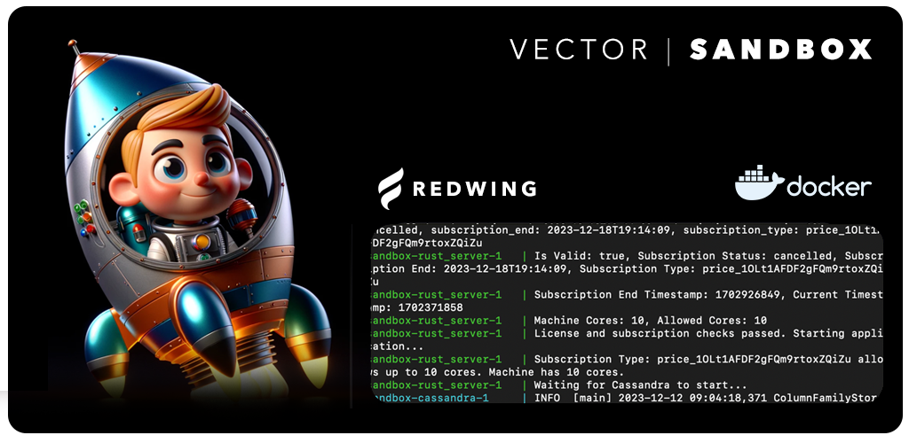

# Vector Sandbox

Welcome to Vector Sandbox. This documentation is designed to streamline your understanding and implementation of our VectorDB client library within your applications.

Before diving into database operations, ensure you have acquired the necessary software license and customer ID by visiting https://redwing.ai/plans. These credentials are essential for container authentication and will be provided to you via email.

## Set environment variables

Upon receiving your license key and customer ID, export them as environment variables in your system:

```
export LICENSE_KEY=[your_license_key]
export CUSTOMER_ID=[your_customer_id]
```

Pull and compose the Vector Docker image, this will start up the server up to the number of cores that are enabled in your software license.

```
docker pull helloredwing/vector && docker-compose up
```

Or run:

```
sh start.sh
```

Once docker is running both the server and the db enter the Cassandra db through the following

```
docker ps
docker exec -it <cassandra-id> bash
```

Then once you are inside the Cassandra container run the following and utilize the db.sh file in this repo

### For testing on local Cassandra with detached Docker

```
docker exec -it redwing_vector-cassandra-1 cqlsh
```

Then run cqlsh commands, todo: incorporate this into the default cassandra db build during provision

```
CREATE KEYSPACE redwing_keyspace WITH replication = {'class': 'SimpleStrategy', 'replication_factor': 1};

CREATE TABLE redwing_keyspace.vectors (
    key text PRIMARY KEY,
    vector list<float>,
    created_at timestamp,
    updated_at timestamp
);
```

Alternatively run:

```
$ apt-get update && apt-get install -y vim
$ touch db.sh
$ vim db.sh

Copy + Paste db.sh contents here and execute :wq

$ sh db.sh
$ exit
```

This should initialize the Vector database keyspace with redwing_vector and establish some tables for you to work with! You are now ready to start utilizing our client libraries to interact with our database and server.

For convenience, we uploaded example scripts with our Python client for you to run outside the Docker container in the ```run``` folder to run them simply execute the following.

```
python test1.py
```

If your system uses Python3

```
python3 test1.py
```

Public Docker Hub image can be viewed here
```
https://hub.docker.com/r/helloredwing/vector
```

For help or questions please reach out to hello [at] redwing.ai or visit our documentation page https://docs.redwing.ai

