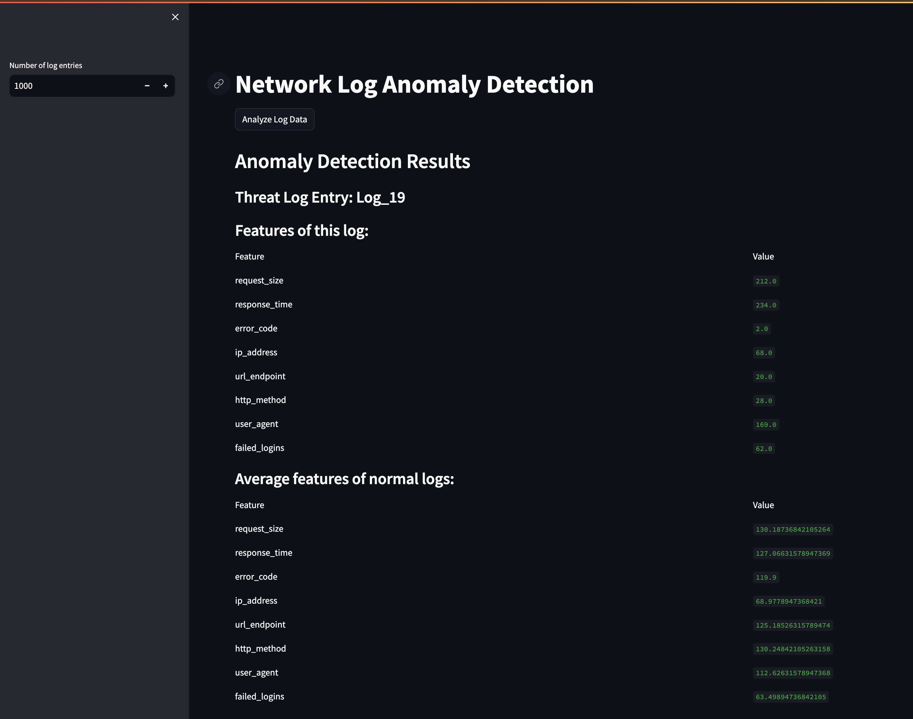

# Vector Dashboard



Example usage

To run network anomalies: 

```
pip install streamlit
streamlit run network_anomaly_dashboard.py
```

To run semantic search:

```
streamlit run healthcare_dashboard.py
```

Implementation for the visualization of Vector generated data using Streamlit.
